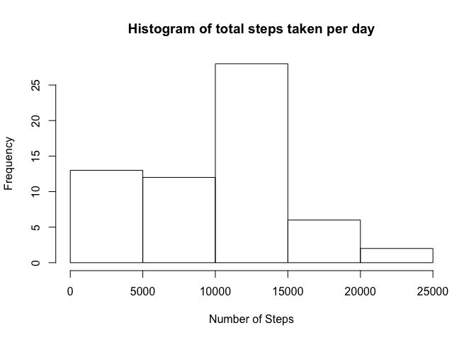
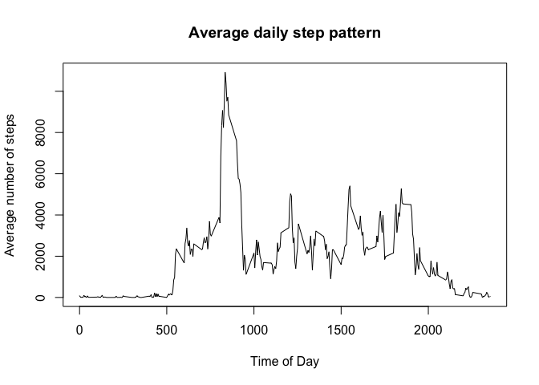
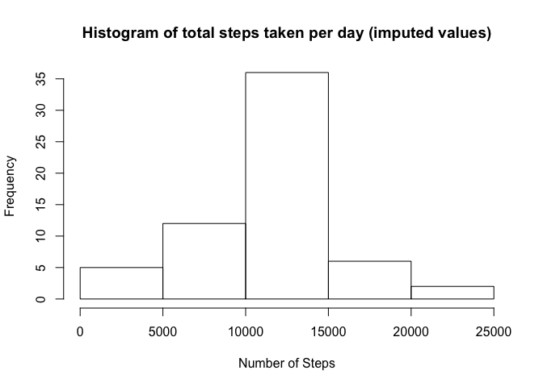
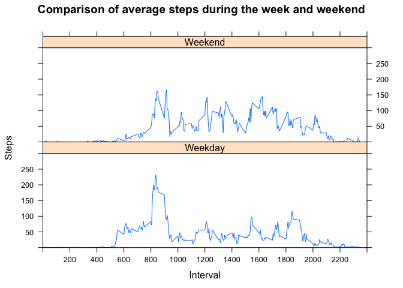

# Reproducible Research: Peer Assessment 1
Suzette Lizamore  
24 June 2017  


# Course Project 1: Activity Monitoring

## Loading and preprocessing the data
Read in the data set which should be located in the working directory


```r
activity <- read.csv("activity.csv")
```

## What is the mean total number of steps taken per day?


```r
## 1. Calculate the number os steps taken per day
TotSteps <- with(activity,tapply(steps,date,sum,na.rm=TRUE))
## 2. Plot Histogram
hist(TotSteps, main = "Histogram of total steps taken per day",xlab = "Number of Steps")
```

<!-- -->

```r
## 3. Report mean and median
cat(c("The mean steps per day is", round(mean(TotSteps),digits=4)))
```

```
## The mean steps per day is 9354.2295
```

```r
cat(c("The median steps per day is", round(median(TotSteps),digits=4)))
```

```
## The median steps per day is 10395
```

## What is the average daily activity pattern?


```r
## 1. Create a time series plot of the average daily activity pattern
activity$interval <- as.factor(activity$interval)
InAvSteps <- with(activity,tapply(steps,interval,sum,na.rm=TRUE))
plot(names(InAvSteps),InAvSteps,type="l",main="Average daily step pattern",
     xlab="Time of Day",ylab="Average number of steps")
```

<!-- -->

```r
## 2. Which five minute interval contains the maximum number of steps
cat(c("The interval with the maximum number of steps is",
      names(InAvSteps[InAvSteps==max(InAvSteps)]), "with", max(InAvSteps),"steps"))
```

```
## The interval with the maximum number of steps is 835 with 10927 steps
```

## Imputing missing values


```r
## 1. Calculate and report the number of missing values in the dataset.
sum(is.na(activity))
```

```
## [1] 2304
```

```r
## 2. Devise a strategy for filling in the missing data
int.means <- ave(activity$steps,activity$interval,FUN = function(x) mean(x[!is.na(x)]))
## 3. Create a data set that is equal to the original but with missing data filled in 
activity.complete <- activity
missing <- is.na(activity$steps)
activity.complete$steps[missing] <- int.means[missing]
## 4. Plot Histogram
TotStepsComp <- with(activity.complete,tapply(steps,date,sum,na.rm=TRUE))
hist(TotStepsComp, main = "Histogram of total steps taken per day (imputed values)",xlab = "Number of Steps")
```

<!-- -->

The mean and median steps per day are as follows


```r
cat(c("The mean steps per day is", round(mean(TotStepsComp),digits=4)))
```

```
## The mean steps per day is 10766.1887
```

```r
cat(c("The median steps per day is", round(median(TotStepsComp),digits=4)))
```

```
## The median steps per day is 10766.1887
```

There is a difference in the mean and median values after the missing values are imputed.
The mean and median have both increased and are now the same. Looking at the two histograms
you can see that there are now fewer days with under 5000 steps.

## Are there differences in activity patterns between weekdays and weekends?


```r
library(lubridate)
```

```
## 
## Attaching package: 'lubridate'
```

```
## The following object is masked from 'package:base':
## 
##     date
```

```r
act.days <- weekdays(dmy(activity.complete$date))
act.days[act.days %in% c("Monday","Tuesday", "Wednesday","Thursday","Friday")] <-  "Weekday" 
act.days[act.days %in% c("Saturday","Sunday")] <- "Weekend"
activity.complete <- cbind(activity.complete,act.days)
activity.summary <- aggregate(activity.complete$steps, by=list(activity.complete$interval, 
        activity.complete$act.days), FUN = mean,na.rm=TRUE)
names(activity.summary) <- c("Interval","Day.Type","Steps")
activity.summary$Interval <- as.numeric(as.character(activity.summary$Interval))
library(lattice)
xyplot(Steps ~ Interval | Day.Type, data = activity.summary,type="l",layout=c(1,2),
       scales=list(x=list(limits=c(0,2400),tick.number=10),y=list(limits=c(0,300))),
       main="Comparison of average steps during the week and weekend")
```

<!-- -->


